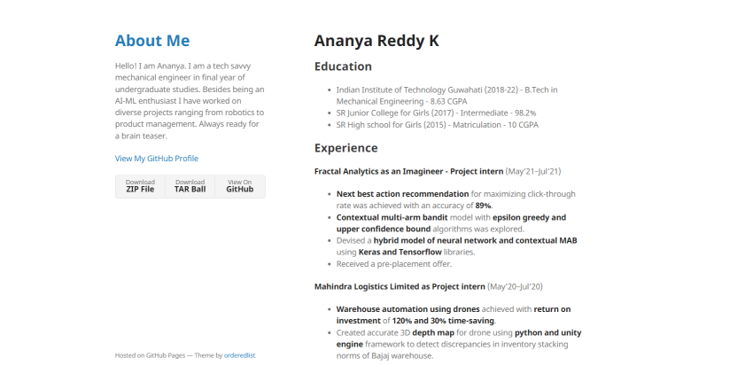

# Hi there! I am Ananya Reddy
Here is my portfolio website. My portfolio site starts with my introduction and then my education, work experience, research experience, projects, skills, certifications and courses pursued, extracurricular activities, achievements, and contact details.

**How did you make it?**
- As I am a beginner, I used the feature of GitHub pages. I chose the **Minimal** theme from the available Jekyll themes in GitHub.
- I modified the code of the theme with the help of [guide to minimal-jekyll theme](https://github.com/pages-themes/minimal)
- I added the title for the page and a small section about me.

Here is a screenshot of my website.

**Why a website??**
- Being a final year undergraduate student placements are crucial. Making a professional resume becomes the first step towards a professional career. A one to two page resume is extremely common place. A graphical resume would be aesthetically and professionally looking and thus, motivated me to make a website for my portfolio.

### Though this is a static website, I plan to develop it better using HTML and CSS to make it better aesthetically. I also plan to add different tabs in the future.
